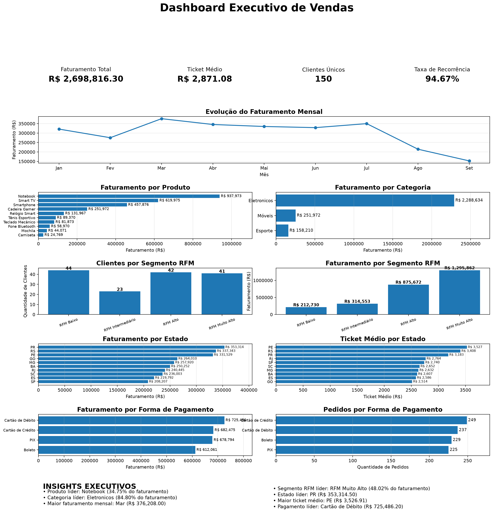

# Análise de Vendas e Risco de Não Recompra em E-commerce

Projeto de portfólio em Python que explora vendas sintéticas de e-commerce, calcula indicadores comerciais, segmenta clientes por RFM e avalia um protótipo de classificação de risco de não recompra.

## Problema de negócio

Como os dados de pedidos podem ajudar a entender o desempenho comercial, identificar padrões de compra e orientar a priorização de clientes?

O projeto percorre a geração dos dados, análise exploratória, KPIs, análises de produtos, categorias, estados e pagamentos, comportamento de clientes, RFM, classificação de risco e visualizações executivas.

## Dados

O arquivo `data/vendas.csv` contém 940 pedidos sintéticos, gerados pelo próprio projeto com seed fixa. Os dados abrangem 01/01/2026 a 24/09/2026 e incluem identificador do pedido e cliente, data, produto, categoria, quantidade, preço, valor, forma de pagamento e estado.

Os dados são exclusivamente educacionais e não representam informações de clientes ou empresas reais. O gerador recria o CSV de forma determinística. Para permitir testar o protótipo, ele atribui perfis latentes antes de gerar as compras: clientes recorrentes recebem 4–9 pedidos históricos e 85% de probabilidade de comprar no período futuro; clientes ocasionais recebem 1–3 pedidos históricos e 10% de probabilidade de compra futura. O perfil não é exportado como variável do dataset; o modelo usa apenas características calculadas a partir do histórico. Essa relação deliberada cria sinal preditivo sintético e não representa uma taxa real de recompra.

## Tecnologias

- Python 3.13
- Pandas
- Matplotlib
- scikit-learn

## Estrutura

```text
data-analytics-ecommerce/
├── data/
│   └── vendas.csv
├── reports/
│   └── dashboard_executivo.png
├── 00_Gerar_dados.py
├── 01_Analise_vendas.py
├── 02_Dashboard_vendas.py
├── requirements.txt
├── README.md
└── .gitignore
```

## Fluxo de análise

1. `00_Gerar_dados.py` gera o dataset sintético em `data/vendas.csv`.
2. `01_Analise_vendas.py` apresenta estatísticas exploratórias, KPIs, análises de produto, categoria, geografia, pagamento e clientes, além da segmentação RFM.
3. `02_Dashboard_vendas.py` consolida visualizações e análises executivas, incluindo o protótipo de Machine Learning e a priorização ilustrativa de clientes. Também salva `reports/dashboard_executivo.png`.

### Prévia do dashboard



## Resultados

### Indicadores gerais

| Indicador | Resultado |
|---|---:|
| Pedidos | 940 |
| Clientes únicos | 150 |
| Faturamento | R$ 2.698.816,30 |
| Ticket médio por pedido | R$ 2.871,08 |
| Clientes recorrentes | 142 |
| Clientes com uma compra | 8 |
| Taxa de recorrência | 94,67% |
| Média de pedidos por cliente | 6,27 |

### Produtos e categorias

Os quatro produtos de maior faturamento representam 84,03% da receita.

| Produto | Participação no faturamento |
|---|---:|
| Notebook | 34,75% |
| Smart TV | 22,97% |
| Smartphone | 16,97% |
| Cadeira Gamer | 9,34% |

| Categoria | Participação no faturamento |
|---|---:|
| Eletrônicos (`Eletronicos` no CSV) | 84,80% |
| Móveis | 9,34% |
| Esporte | 5,86% |

O maior faturamento mensal ocorreu em março (R$ 376.208,00). Cartão de débito liderou em faturamento (R$ 725.486,20 em 237 pedidos).

### Comportamento dos clientes

Os 30 clientes que compõem os 20% de maior faturamento concentram R$ 1.190.863,70, equivalentes a 44,13% da receita. Oito pedidos é a maior frequência observada, atingida por três clientes.

### Leituras para o negócio

Como a base é sintética, estes pontos são hipóteses para investigação, não conclusões sobre um e-commerce real:

- A concentração de 84,03% da receita nos quatro principais produtos sugere acompanhar disponibilidade e dependência de receita por produto antes de planejar campanhas ou estoque.
- Os 30 clientes de maior faturamento respondem por 44,13% da receita; uma ação de relacionamento pode ser testada com grupo de controle para medir efeito incremental.
- PR lidera em faturamento e PE tem o maior ticket médio nesta amostra. Uma análise real deveria comparar mix de produtos, margem e custos logísticos por estado antes de priorizar investimento regional.
- Cartão de débito lidera em pedidos e faturamento. Como o dataset não registra tentativas, cancelamentos ou pagamentos recusados, não permite avaliar conversão ou preferência de pagamento de forma causal.
- A taxa de recorrência de 94,67% descreve apenas este gerador e esta janela; não deve ser tratada como benchmark de mercado.

### Análise geográfica

O Paraná (PR) lidera em faturamento, enquanto Pernambuco (PE) tem o maior ticket médio.

| Estado | Faturamento | Ticket médio |
|---|---:|---:|
| PR | R$ 353.314,50 | R$ 3.183,01 |
| RS | R$ 337.342,60 | R$ 3.407,50 |
| PE | R$ 331.529,30 | R$ 3.526,91 |

### Segmentação RFM

A pontuação combina recência, frequência e valor monetário, cada dimensão pontuada de 1 a 4. Os grupos são definidos pelo score total calculado em `01_Analise_vendas.py`; o dashboard utiliza as mesmas faixas.

| Segmento | Clientes | Faturamento | Participação |
|---|---:|---:|---:|
| RFM Muito Alto | 41 | R$ 1.295.861,70 | 48,02% |
| RFM Alto | 42 | R$ 875.671,70 | 32,45% |
| RFM Intermediário | 23 | R$ 314.552,80 | 11,66% |
| RFM Baixo | 44 | R$ 212.730,10 | 7,88% |

## Protótipo de Machine Learning

O objetivo é classificar clientes históricos com maior probabilidade de não realizar uma compra no período futuro observado. A coorte de features contém clientes com compras até 31/07/2026; o rótulo considera compras de 01/08/2026 a 24/09/2026. O dataset contém 798 pedidos históricos de 150 clientes e 142 pedidos futuros de 100 clientes.

As features são calculadas apenas com o histórico até a data de corte: pedidos, faturamento, ticket médio, unidades, produtos distintos, dias de atividade, frequência de pedidos e dias desde a última compra até o corte. O alvo vale 1 quando o cliente histórico não comprou na janela futura e 0 quando comprou.

Foi usado um split estratificado de clientes em treino e teste (80/20, `random_state=42`). A validação cruzada estratificada de 5 folds é calculada somente no treino; o holdout fica separado até a avaliação final. As métricas de risco referem-se à classe positiva “não comprou”.

Médias da validação cruzada no treino:

| Modelo | Acurácia | Precisão (risco) | Recall (risco) | F1 (risco) |
|---|---:|---:|---:|---:|
| Regressão Logística | 80,00% | 71,38% | 67,50% | 68,08% |
| Random Forest | 85,83% | 77,05% | 82,50% | 78,71% |

Resultados no holdout de 30 clientes:

| Modelo | Acurácia | Precisão (risco) | Recall (risco) | F1 (risco) |
|---|---:|---:|---:|---:|
| Regressão Logística | 86,67% | 100,00% | 60,00% | 75,00% |
| Random Forest | 86,67% | 100,00% | 60,00% | 75,00% |

O Random Forest foi mantido como modelo de referência pela melhor média de F1 e recall na validação cruzada. No ajuste de treino, as cinco maiores importâncias foram pedidos (25,67%), unidades (18,35%), produtos distintos (12,38%), dias ativos (12,36%) e faturamento (11,59%). Essa importância descreve o uso das variáveis nas árvores; não mede efeito causal nem garante estabilidade em outra amostra.

O resultado demonstra que o modelo consegue aprender os padrões inseridos no gerador. Ele não comprova desempenho em dados de empresas reais: o holdout contém apenas 30 clientes e o dataset foi construído intencionalmente com perfis de recompra distintos. A classificação operacional usa faixas heurísticas de probabilidade e a priorização combina essas faixas com intervalos fixos de faturamento. O ranking exibido é restrito aos clientes do holdout e serve como demonstração analítica.

## Limitações

- Dataset sintético pequeno, com perfis de compra deliberadamente separáveis e sem sazonalidade ou comportamento de mercado realista garantido.
- Um único período futuro e um único split aleatório por cliente; a validação cruzada é interna ao treino e não substitui validação em períodos futuros independentes.
- O desempenho elevado mede a recuperação de padrões do gerador, não a eficácia esperada em clientes reais.
- Limites de risco e valor financeiro são heurísticos, não calibrados para uma operação real.
- O modelo e a priorização são protótipos de portfólio, não um sistema de churn pronto para produção.

## Próximas análises recomendadas

Estas são possibilidades para uma evolução futura, não resultados deste projeto:

- Comparar coortes de clientes por mês da primeira compra e medir retenção ao longo do tempo.
- Avaliar concentração e recorrência por produto, categoria e estado, distinguindo quantidade de pedidos de faturamento.
- Repetir a avaliação do modelo em mais de uma janela temporal e comparar com um baseline simples antes de ajustar limiares de priorização.
- Aumentar o realismo do gerador com sazonalidade, probabilidades de recompra e perfis de clientes; atualmente os dados são sintéticos e não devem sustentar decisões comerciais reais.

## Como executar

Requer Python 3.13. Na raiz do projeto, crie e ative um ambiente virtual, instale as versões testadas em `requirements.txt` e execute os scripts nesta ordem:

```bash
python -m venv .venv
# Windows PowerShell: .venv\Scripts\Activate.ps1
# Linux/macOS: source .venv/bin/activate
python -m pip install -r requirements.txt
python 00_Gerar_dados.py
python 01_Analise_vendas.py
python 02_Dashboard_vendas.py
```

O dashboard também gera a imagem usada nesta página. Os scripts de análise exibem gráficos e podem ser executados em sequência em um ambiente com interface gráfica.
